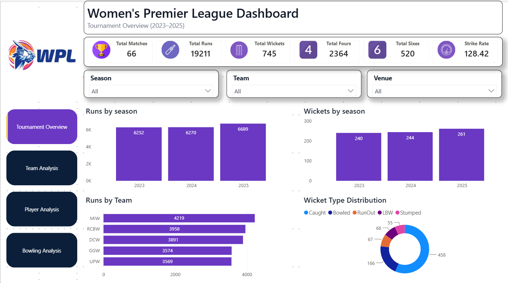
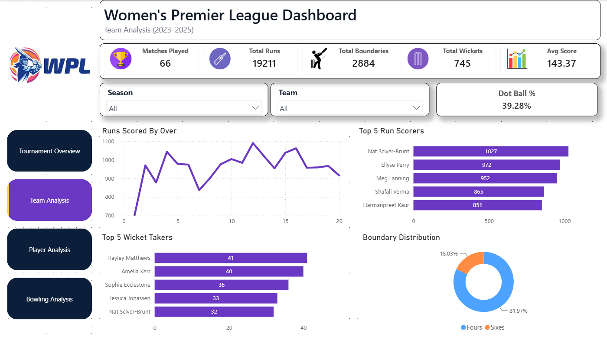
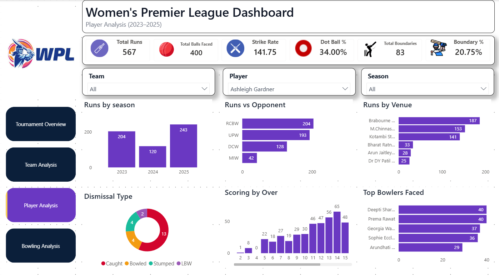
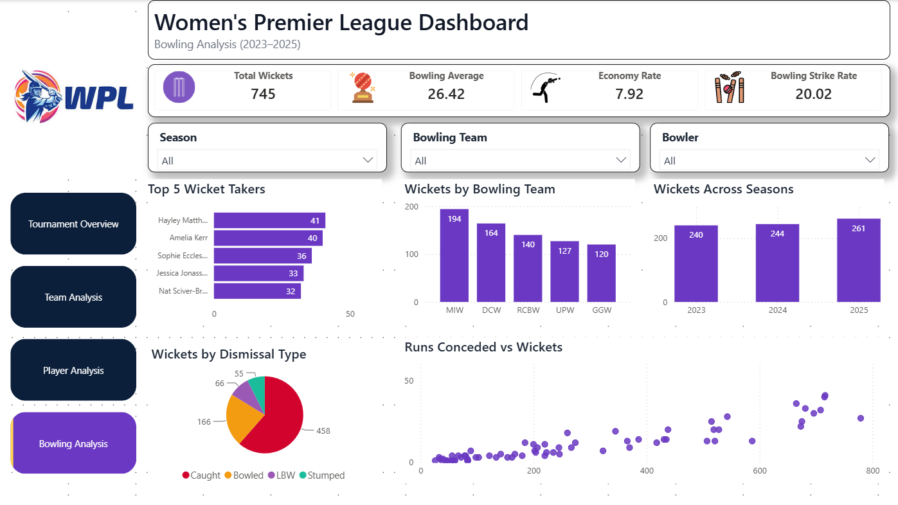
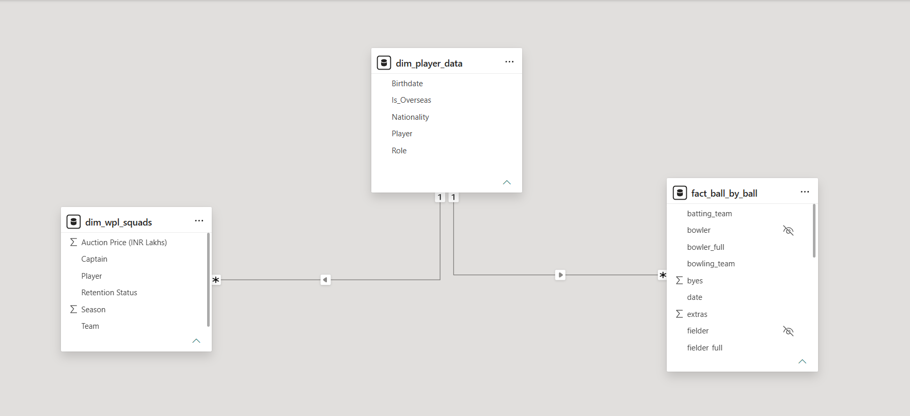

# 🏏 Women's Premier League (WPL) Analytics Dashboard

<p align="center">

**An interactive Power BI dashboard analysing Women's Premier League (WPL) matches across the 2023–2025 seasons using ball-by-ball cricket data.**

</p>

---

## 📌 Project Overview

This project presents an end-to-end Power BI analytics solution built using ball-by-ball data from the Women's Premier League (WPL).

The dashboard enables users to explore tournament trends, compare team performances, analyse player statistics, and evaluate bowling performances through interactive visualisations and cricket-specific KPIs.

The project demonstrates the complete analytics workflow including data preparation, data modelling, DAX calculations, and dashboard design.

---

# 📊 Dashboard Preview

| Tournament Overview | Team Analysis |
|---------------------|--------------|
|  |  |

| Player Analysis | Bowling Analysis |
|-----------------|-----------------|
|  |  |

---

# 🏗 Data Model



The report follows a **Star Schema** consisting of a central fact table connected to multiple dimension tables for efficient filtering and DAX calculations.

---

# 📈 Dashboard Features

### 🏆 Tournament Overview
- Tournament KPIs
- Match Summary
- Average Score
- Boundary Percentage
- Toss Analysis
- Venue Analysis

### 👥 Team Analysis
- Team Comparison
- Batting Performance
- Bowling Performance
- Win Percentage
- Dot Ball Percentage
- Team Filters

### 🏏 Player Analysis
- Batting Statistics
- Strike Rate
- Boundary Percentage
- Dismissal Analysis
- Top Performers
- Interactive Player Filters

### 🎯 Bowling Analysis
- Economy Rate
- Bowling Average
- Bowling Strike Rate
- Top Wicket Takers
- Wicket Type Analysis
- Bowling Performance Comparison

---

# 📌 Key Performance Indicators (KPIs)

- Total Runs
- Total Wickets
- Matches Played
- Average Score
- Strike Rate
- Economy Rate
- Bowling Average
- Dot Ball %
- Boundary %
- Total Balls Faced

---

# 🛠 Tools & Technologies

| Category | Tools |
|----------|------|
| Visualisation | Microsoft Power BI |
| Data Cleaning | Power Query |
| Data Modelling | Star Schema |
| Calculations | DAX |
| Data Source | Excel / CSV |

---

# 🧠 Skills Demonstrated

- Data Cleaning & Transformation
- Data Modelling
- Star Schema Design
- DAX Measure Development
- KPI Development
- Interactive Dashboard Design
- Business Intelligence
- Sports Analytics

---

# 📂 Repository Contents

```
📁 WPL-PowerBI-Analytics
│
├── WPL Analysis.pbix
├── Tournament_Overview.png
├── Team_Analysis.png
├── Player_Analysis.png
├── Bowling_Analysis.png
├── Data_Model.png
└── README.md
```

---

# 🚀 Future Enhancements

- Match-by-Match Analysis
- Player Comparison Dashboard
- Venue Performance Analysis
- Head-to-Head Team Comparison
- Predictive Analytics using Python
- Power BI Service Deployment

---

# 👨‍💻 Author

**Amey Joshi**

Aspiring Data Analyst | Sports Analytics Enthusiast | Power BI Developer

🔗 **LinkedIn:** *(Add your LinkedIn profile URL here)*

---

⭐ *If you found this project interesting, consider giving it a star!*
